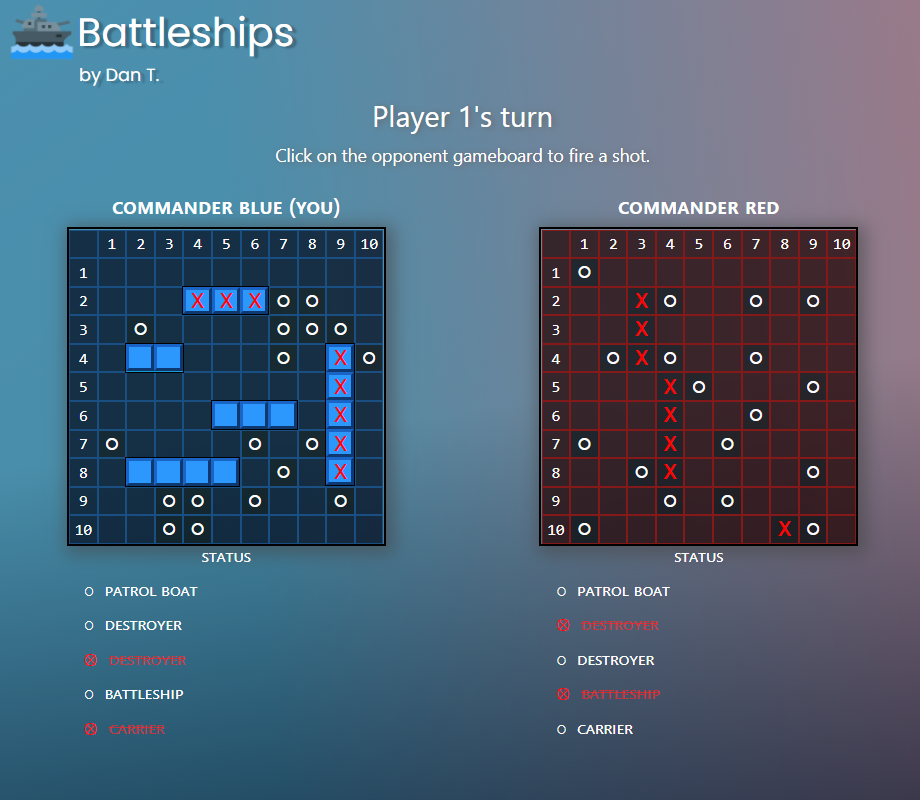

# Battleships

**View Demo: https://datrinon.github.io/battleships/**

A game of battleships against an AI. This project was also to practice using Jest
for test-driven development.

## Features
- Play the classic Battleships game.
- Move and rotate ships.
- Competent AI. Does more than just guess random numbers; focuses on an area if it scores a hit.

## Technical Details
- Built with vanilla JS and CSS.
- TDD done with Jest.
- Tooling includes webpack and npm.
